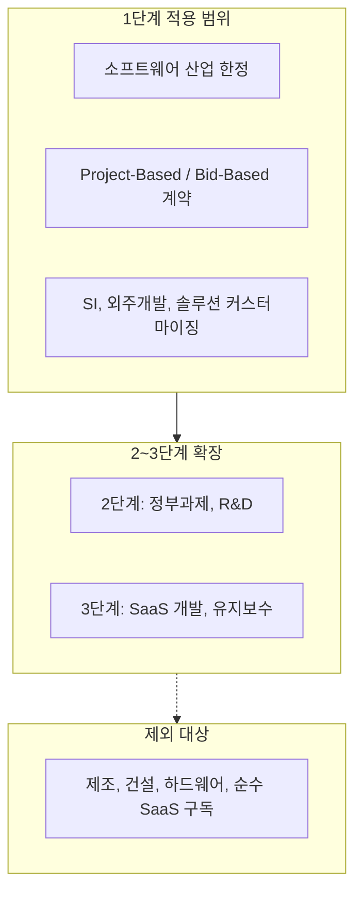
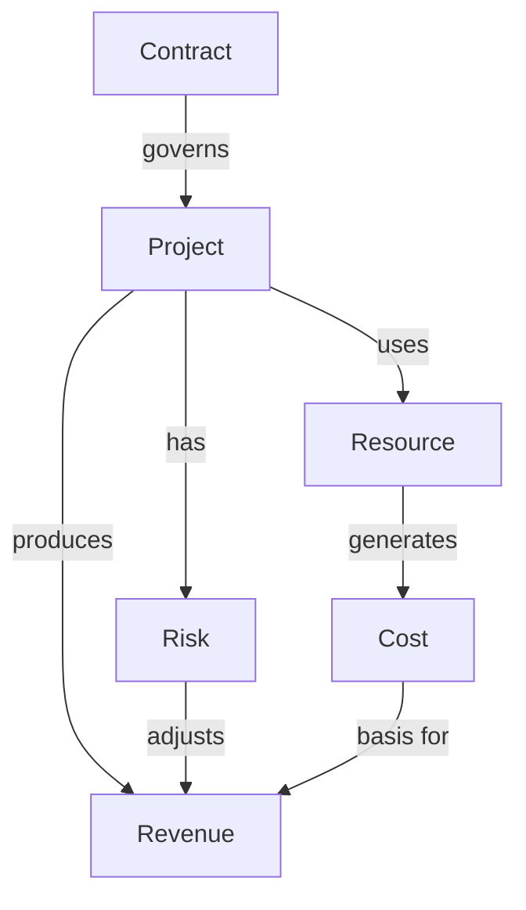
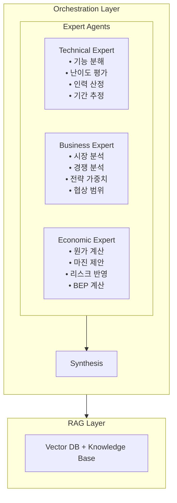
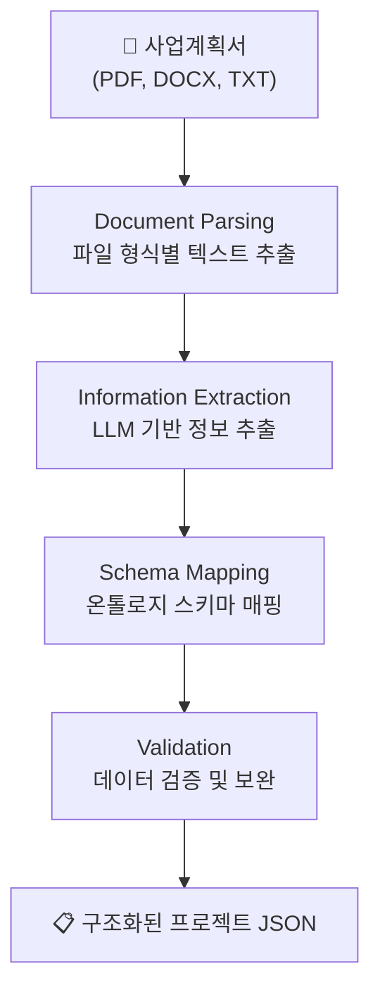
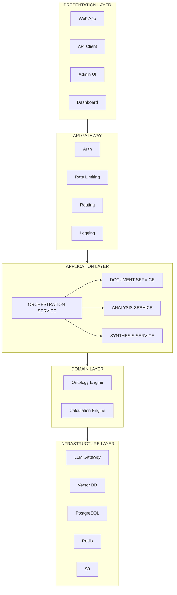
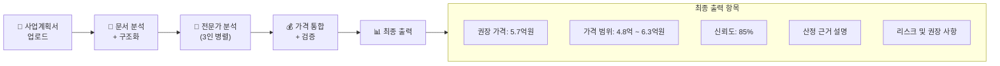

# AI 기반 프로젝트 가격산정 시스템 - 종합 요약

---

## 시스템 한 줄 정의

> **사업계획서를 입력받아 다중 전문가 시뮬레이션과 온톨로지 기반 구조화를 통해 프로젝트 가격을 자동 산정하는 AI 의사결정 지원 시스템**

---

## 전체 Phase 구조

```plaintext
Phase 1   프로젝트 개요         → 문제 정의, 목표, 타겟 사용자
Phase 2   도메인 범위          → 산업/계약 유형 범위, 제외 항목
Phase 3   데이터 정의          → 프로젝트/비용/가격/참조 데이터
Phase 4   온톨로지 설계        → Core/Project/Cost/Pricing 온톨로지
Phase 5   멀티에이전트 설계     → 기술/경제/사업 전문가 에이전트
Phase 6   계산 엔진            → 원가 계산 공식, 가격 산정 공식
Phase 7   문서 분석 레이어      → 문서 파싱, 정보 추출, 스키마 매핑
Phase 8   RAG 설계             → 지식베이스, 임베딩, 검색 전략
Phase 9   통합 의사결정 레이어  → 충돌 조정, 최종 가격 결정
Phase 10  검증 체계            → 정확성 평가, 피드백, 개선 사이클
Phase 11  최종 아키텍처        → 시스템 구조, 배포, 보안, 운영
```

---

## Phase별 핵심 요약

### Phase 1: 프로젝트 개요

| 항목 | 내용 |
|------|------|
| **문제** | 중소기업이 비정형 사업계획서에서 합리적 가격을 산정하기 어려움 |
| **해결** | 문서 이해 + 구조화 + 다중 전문가 판단 + 계산 엔진 통합 |
| **타겟** | 중소기업 대표, 스타트업 창업자, SI 영업 담당자 |
| **산출물** | 최종 가격, 산정 근거 리포트, 리스크/전략 설명 |
| **성공 기준** | 오차율 20% 이내, 5분 내 결과 제공 |

---

### Phase 2: 도메인 범위



**핵심 원칙**: Core Ontology 유지 + 도메인 확장 구조

---

### Phase 3: 데이터 정의

| 데이터 유형 | 핵심 항목 |
|------------|----------|
| **프로젝트 데이터** | 유형, 범위, 기능 목록, 타임라인, 인력 구성 |
| **비용 데이터** | 인건비, 인프라비, 도구비, 외주비, 간접비 |
| **가격 데이터** | 마진 정책, 리스크 프리미엄, 전략 가중치 |
| **참조 데이터** | 노임단가, 인프라 단가, 유사 프로젝트 사례 |

---

### Phase 4: 온톨로지 설계



| 온톨로지 | 핵심 개념 | 비고 |
|----------|----------|----------| 
| **Core** | Project, Cost, Revenue, Contract, Resource, Risk | |
| **Project** | SoftwareProject, Scope, Feature, Timeline, Role, Complexity | |
| **Cost** | LaborCost, InfrastructureCost, ToolCost, ExternalCost | 지출 비용 (원가) |
| **Pricing** | MarginPolicy, RiskPremium, StrategicWeight | 수익 비용 (판매가) |

---

### Phase 5: 멀티에이전트 설계



| 전문가 | 입력 | 출력 |
|--------|------|------|
| **기술** | 사업계획서, 기능 목록 | 복잡도, 인력 구성, 기간 |
| **경제** | 인력/기간, 비용 기준 | 원가, 마진, 손익분기점 |
| **사업** | 프로젝트/고객/시장 정보 | 전략 가중치, 경쟁 강도, 할인 범위 |

---

### Phase 6: 계산 엔진

#### 원가 계산 공식

```text
총 원가 = 직접비 + 간접비 + 예비비

직접비 = 인건비 + 인프라비 + 도구비 + 외부비용
인건비 = Σ(투입인원 × 투입기간 × 투입률 × 월노임단가)

간접비 (공공) = 제경비(110%) + 기술료(25%)
간접비 (민간) = 직접비 × 40%

예비비 = 리스크 수준별 3~12%
```

#### 가격 산정 공식

```text
최종 가격 = 원가 × (1 + 마진) × (1 + 리스크프리미엄) × 전략가중치

마진: 10~30% (기본 15%)
리스크 프리미엄: 0~20%
전략 가중치: 0.8~1.2
```

---

### Phase 7: 문서 분석 레이어



**추출 항목**: 프로젝트명/유형, 기능 목록, 일정/예산, 기술 요구사항, 고객 정보

---

### Phase 8: RAG 설계

| 전문가 | RAG 활용 목적 | 검색 대상 |
|--------|-------------|----------|
| **기술** | 유사 프로젝트 참조, 기술 난이도 | 과거 프로젝트 사례 |
| **경제** | 평균 단가, 마진 벤치마크 | 직무별 시장 단가, SW사업 대가기준 |
| **사업** | 시장 동향, 경쟁 상황 | 산업 트렌드, 협상 사례 |

**지식베이스 구조**:
- ProjectCases: 프로젝트 사례
- PricingReferences: 단가 참조
- MarketIntelligence: 시장 정보
- RiskCases: 리스크 사례

**검색 전략**: 벡터 검색 + 키워드 검색 하이브리드 (RRF 결합)

---

### Phase 9: 통합 의사결정 레이어


**충돌 유형 및 조정**:

| 충돌 유형 | 조정 전략 |
|----------|----------|
| 기간-비용 불일치 | 가중 평균 (기술 70%, 경제 30%) |
| 마진-전략 충돌 | 경쟁 상황에 따른 마진 조정 |
| 리스크 중복 | 중복 리스크 제거 |
| 범위 초과 | 범위 클램핑 + 경고 |

**출력**: 최종 가격, 가격 범위, 산정 근거 설명, 신뢰도

---

### Phase 10: 검증 체계

#### 실시간 검증

| 검증 유형 | 내용 |
|----------|------|
| **범위 검증** | 가격/마진/기간의 합리적 범위 확인 |
| **일관성 검증** | 동일 조건에서의 출력 변동 확인 |
| **완전성 검증** | 필수 출력 항목 충족 확인 |
| **로직 검증** | 계산 공식의 정합성 확인 |

#### 정확성 평가

| 메트릭 | 목표 |
|--------|------|
| **MAPE** | < 10% |
| **15% 내 적중률** | > 80% |
| **25% 내 적중률** | > 95% |

#### 개선 사이클


---

### Phase 11: 최종 아키텍처



#### 기술 스택

| 영역 | 기술 |
|------|------|
| **LLM** | OpenAI GPT-4, Claude 3 (Fallback) |
| **Vector DB** | Pinecone / Weaviate |
| **DB** | PostgreSQL |
| **Cache** | Redis |
| **Container** | Kubernetes (EKS/GKE) |
| **Monitoring** | Prometheus + Grafana |

---

## 핵심 가격 산정 플로우



---

## 구현 로드맵

| Phase | 내용 | 핵심 산출물 |
|:-----:|------|------------|
| 1 | Foundation (MVP) | Document Service, Technical Agent, Basic API |
| 2 | Multi-Agent | Economic/Business Agent, Conflict Resolution |
| 3 | RAG Integration | Vector DB, Knowledge Base, RAG 통합 |
| 4 | Evaluation | Feedback, Accuracy Measurement, Auto-tuning |
| 5 | Production Ready | Security, Performance, Monitoring |

---

## 문서 목록

```text
.claude/
├── 00_도메인 구조화.md         # 초기 아이디어
├── 01_gpt와 논의 초안.md       # GPT 논의 초안
├── 대분류.md                  # 전체 설계 계획서
│
├── 01_overview/
│   └── project_goal.md        # 프로젝트 목표 정의
├── 02_domain/
│   └── boundary.md            # 도메인 범위 정의
├── 03_data/
│   ├── project_data.md        # 프로젝트 데이터
│   ├── cost_data.md           # 비용 데이터
│   ├── pricing_data.md        # 가격 데이터
│   └── reference_data.md      # 참조 데이터
├── 04_ontology/
│   ├── core.md                # Core 온톨로지
│   ├── project.md             # Project 온톨로지
│   ├── cost.md                # Cost 온톨로지
│   └── pricing.md             # Pricing 온톨로지
├── 05_agent/
│   ├── overview.md            # 멀티에이전트 개요
│   ├── technical_expert.md    # 기술 전문가
│   ├── business_expert.md     # 사업 전문가
│   └── economic_expert.md     # 경제 전문가
├── 06_engine/
│   ├── cost_formula.md        # 원가 계산 공식
│   └── pricing_formula.md     # 가격 산정 공식
├── 07_document/
│   └── understanding_layer.md # 문서 분석 레이어
├── 08_rag/
│   └── rag_design.md          # RAG 설계
├── 09_synthesis/
│   └── synthesis_layer.md     # 통합 의사결정 레이어
├── 10_evaluation/
│   └── evaluation_framework.md # 검증 체계
├── 11_architecture/
│   └── system_architecture.md # 최종 아키텍처
│
└── SUMMARY.md                 # 이 문서 (종합 요약)
```

---

## 작성 정보

- **작성일**: 2026-02-26
- **전체 Phase 완료**
- **문서 버전**: 1.0
