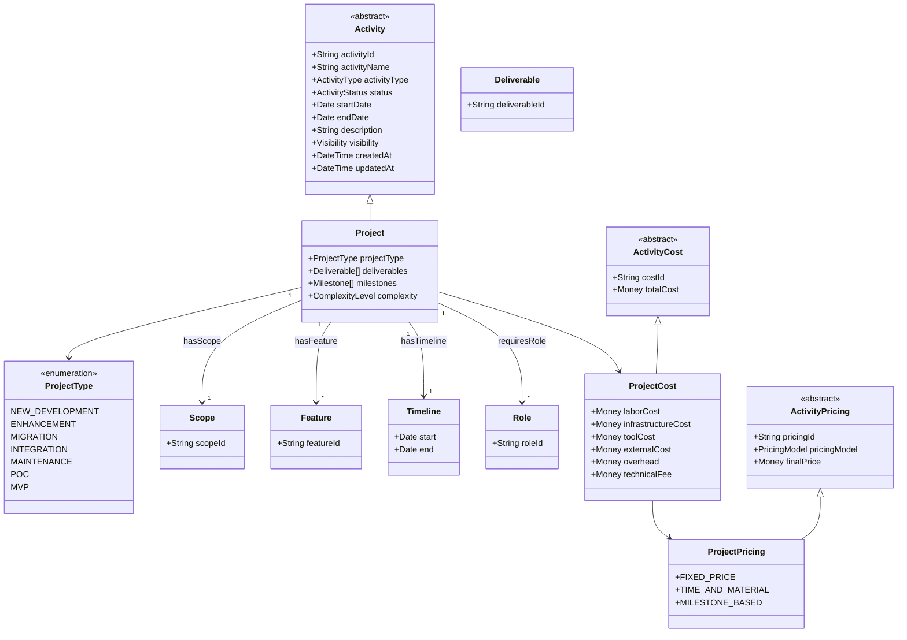

# MVP 데이터 수집 계획: 중소기업 견적산정

---

## 1. 프로젝트 개요

### 1.1 목표
- Core Ontology 구조를 기반으로 중소기업 SW프로젝트 견적산정용 RAG 시스템 데이터 수집
- 공공 입찰 정보(나라장터)를 크롤링하여 Cost + Project + Pricing 데이터 확보

### 1.2 핵심 설정

| 항목 | 결정 |
|------|------|
| 활용 목적 | RAG 시스템 구축 |
| 데이터 출처 | 나라장터 공공 입찰 정보 크롤링 |
| 크롤링 범위 | SW개발/SI 전체 |
| 저장 형식 | JSONL (라인별 JSON) |

### 1.3 관련 문서

| 문서 | 경로 | 설명 |
|------|------|------|
| Core Ontology v2 | `docs/04_ontology/core_v2.md` | Activity 기반 범용 구조 |
| Cost Ontology | `docs/04_ontology/cost.md` | 원가 산정 모델 |
| Pricing Ontology | `docs/04_ontology/pricing.md` | 가격 산정 모델 |
| SW Project Extension | `docs/04_ontology/extensions/software_project.md` | 소프트웨어 프로젝트 확장 |
| 데이터 요구사항 | `docs/04_ontology/data_requirements.md` | 데이터 수집 가이드 |

---

## 2. 수집 대상 데이터

### 2.1 Cost 데이터 (원가 산정 참조)

| 데이터 | 출처 | 우선순위 | 파일 |
|--------|------|----------|------|
| SW기술자 노임단가 (등급별) | KOSA, 과기정통부 | P0 | `data/cost/labor_rates.jsonl` |
| 제경비율 (110~120%) | SW사업 대가산정 가이드 | P0 | `data/cost/indirect_rates.jsonl` |
| 기술료율 (20~40%) | SW사업 대가산정 가이드 | P0 | `data/cost/indirect_rates.jsonl` |
| FP당 단가 | 대가산정 가이드 | P1 | `data/cost/fp_rates.jsonl` |
| 규모별 보정계수 | 대가산정 가이드 | P1 | `data/cost/adjustment_factors.jsonl` |

### 2.2 Project 구조 데이터 (입찰공고에서 추출)

| 데이터 | 온톨로지 매핑 | 우선순위 |
|--------|--------------|----------|
| 사업명/개요 | `SoftwareProject.activityName`, `description` | P0 |
| 예정가격/추정가 | `Cost.amount` | P0 |
| 사업 기간 | `Timeline.totalDuration` | P0 |
| 기능점수(FP) | `Scope.totalFP` | P1 |
| 투입인력 구성 | `Role[]` | P1 |
| 기술스택 요구사항 | `SoftwareProject.techStack` | P2 |

### 2.3 Pricing 데이터 (낙찰정보에서 추출)

| 데이터 | 온톨로지 매핑 | 우선순위 |
|--------|--------------|----------|
| 낙찰가격 | `Revenue.finalPrice` | P0 |
| 낙찰률 | `MarginPolicy.effectiveRate` (역산) | P0 |
| 참여업체 수 | `CompetitiveAdjustment.competitorCount` | P0 |
| 투찰가격 분포 | `CompetitiveAdjustment.priceRange` | P1 |

---

## 3. 데이터 수집 방법

### 3.1 크롤링 대상

```
나라장터 (g2b.go.kr)
├── 입찰공고 (SW개발, SI, 정보시스템)
│   ├── 사업 개요
│   ├── 예정가격
│   ├── 사업 기간
│   └── 첨부파일 (RFP, 과업지시서)
│
└── 낙찰정보
    ├── 낙찰가격
    ├── 낙찰업체
    └── 투찰현황
```

### 3.2 수집 흐름

```
[1] 나라장터 검색
    - 키워드: "소프트웨어개발", "시스템구축", "SI", "정보화"
    - 필터: 용역, 입찰공고/낙찰정보

[2] 목록 수집 → JSONL 저장

[3] 상세 페이지 파싱
    - 사업개요, 금액, 기간 추출

[4] 첨부파일 처리 (선택)
    - RFP PDF → 텍스트 추출

[5] 온톨로지 매핑
    - Core/Extension 스키마에 맞춰 변환
```

### 3.3 공식 참조 데이터 수집

| 출처 | 데이터 | 방법 |
|------|--------|------|
| KOSA | 노임단가표 | PDF 파싱 또는 수동 입력 |
| 과기정통부 | 대가산정 가이드 | PDF에서 테이블 추출 |
| 공공데이터포털 | 조달청 API | REST API 호출 |

---

## 4. JSONL 데이터 스키마

### 4.1 Cost Reference

#### `data/cost/labor_rates.jsonl`
```json
{"type":"labor_rate","grade":"특급","gradeCode":"EXPERT","monthlyRate":12000000,"dailyRate":550000,"hourlyRate":68750,"minExperience":12,"year":2026,"source":"KOSA","sourceUrl":"https://kosa.or.kr"}
{"type":"labor_rate","grade":"고급","gradeCode":"SENIOR","monthlyRate":10000000,"dailyRate":450000,"hourlyRate":56250,"minExperience":7,"year":2026,"source":"KOSA","sourceUrl":"https://kosa.or.kr"}
{"type":"labor_rate","grade":"중급","gradeCode":"MID","monthlyRate":8000000,"dailyRate":360000,"hourlyRate":45000,"minExperience":3,"year":2026,"source":"KOSA","sourceUrl":"https://kosa.or.kr"}
{"type":"labor_rate","grade":"초급","gradeCode":"JUNIOR","monthlyRate":5500000,"dailyRate":250000,"hourlyRate":31250,"minExperience":0,"year":2026,"source":"KOSA","sourceUrl":"https://kosa.or.kr"}
```

#### `data/cost/indirect_rates.jsonl`
```json
{"type":"indirect_rate","category":"제경비","rateType":"overhead","minRate":110,"maxRate":120,"defaultRate":110,"baseOn":"직접인건비","year":2026,"source":"SW사업 대가산정 가이드"}
{"type":"indirect_rate","category":"기술료","rateType":"technicalFee","minRate":20,"maxRate":40,"defaultRate":25,"baseOn":"직접인건비+제경비","year":2026,"source":"SW사업 대가산정 가이드"}
{"type":"indirect_rate","category":"일반관리비","rateType":"adminFee","minRate":6,"maxRate":6,"defaultRate":6,"baseOn":"직접비","year":2026,"source":"기업회계기준"}
```

### 4.2 Project Sample

#### `data/project/g2b_projects.jsonl`
```json
{"bidId":"G2B-2026-001","title":"OO관리시스템 구축","description":"...","scope":{"totalFP":850,"moduleCount":8,"screenCount":45},"timeline":{"duration":6,"unit":"MONTH","startDate":"2026-04-01"},"estimatedPrice":500000000,"category":"WEB_APPLICATION","systemType":"CRM","techStack":["Java","Spring","PostgreSQL"],"source":"나라장터","crawledAt":"2026-02-28T10:00:00Z"}
```

### 4.3 Pricing Data

#### `data/pricing/bid_results.jsonl`
```json
{"bidId":"G2B-2026-001","estimatedPrice":500000000,"winningPrice":450000000,"winningRate":90.0,"competitorCount":5,"bidDate":"2026-01-15","winnerName":"OO시스템(주)","contractType":"협상에의한계약","impliedMargin":10.0}
```

---

## 5. 구현 단계

### Step 1: 참조 데이터 수집 (수동/반자동)
- [x] 폴더 구조 생성
- [ ] 2026년 SW기술자 노임단가표 입력
- [ ] SW사업 대가산정 가이드에서 비율 추출
- [ ] `data/cost/` 폴더에 JSONL로 저장

### Step 2: 나라장터 크롤러 개발
- [ ] 입찰공고 검색 및 목록 수집
- [ ] 상세 페이지 파싱 (사업개요, 금액, 기간)
- [ ] 낙찰정보 수집
- [ ] Rate limiting 및 에러 처리

### Step 3: 데이터 파싱 및 구조화
- [ ] HTML → 온톨로지 필드 매핑
- [ ] JSONL 형식으로 저장
- [ ] 데이터 검증 스크립트

### Step 4: RAG 준비
- [ ] JSONL 데이터 검토 및 정제
- [ ] 메타데이터 보강
- [ ] 벡터 임베딩 (선택)

---

## 6. 산출물 구조

```
ontology-data-beta/
├── docs/
│   └── data-project/
│       └── planning.md          # 이 계획 문서
│
├── data/
│   ├── cost/
│   │   ├── labor_rates.jsonl    # 노임단가
│   │   ├── indirect_rates.jsonl # 제경비/기술료율
│   │   ├── fp_rates.jsonl       # FP당 단가
│   │   └── adjustment_factors.jsonl # 보정계수
│   │
│   ├── project/
│   │   └── g2b_projects.jsonl   # 프로젝트 구조 샘플
│   │
│   └── pricing/
│       └── bid_results.jsonl    # 입찰/낙찰 정보
│
└── src/
    ├── crawler/
    │   └── g2b_crawler.py       # 나라장터 크롤러
    ├── parser/
    │   └── bid_parser.py        # 입찰공고 파서
    └── schema/
        └── ontology_mapping.py  # 온톨로지 매핑
```

---

## 7. 온톨로지 연계

### 7.1 Core Ontology 매핑

| 수집 데이터 | Core Ontology | Extension | 비고 |
|------------|---------------|-----------|------|
| 사업 정보 | Activity → Project | SoftwareProject | activityType: PROJECT |
| 금액 정보 | Cost | ProjectCost | costType별 분리 |
| 기간/일정 | Timeline | Phase, Milestone | phaseType 매핑 |
| 인력 구성 | Resource | Role | roleType, skillLevel |
| 낙찰 결과 | Revenue | Pricing | finalPrice |

### 7.1.1 Project 상속 구조 (Activity 기반)



### 7.2 Pricing Ontology 연계

| 수집 데이터 | Pricing 필드 | 활용 |
|------------|-------------|------|
| 낙찰률 | MarginPolicy.effectiveRate | 실제 마진율 역산 |
| 경쟁업체 수 | CompetitiveAdjustment.competitorCount | 경쟁 수준 분석 |
| 예정가-낙찰가 | PriceRange | 협상 범위 참고 |
| 계약 유형 | Contract.contractType | 가격 전략 참고 |

### 7.3 데이터 흐름

```
[입찰공고] ────────────────────────────────────────────┐
    │                                                   │
    ├── 사업명 → SoftwareProject.activityName          │
    ├── 예정가격 → Cost.baseCost                        │
    ├── 기간 → Timeline.totalDuration                   │
    └── RFP → Scope, Feature, Role (파싱 시)           │
                                                        │
[낙찰정보] ────────────────────────────────────────────┤
    │                                                   │
    ├── 낙찰가 → Revenue.finalPrice                     │
    ├── 낙찰률 → MarginPolicy 분석                      ├──► RAG System
    ├── 경쟁사 수 → CompetitiveAdjustment              │
    └── 투찰 분포 → PriceRange                          │
                                                        │
[참조 데이터] ──────────────────────────────────────────┘
    │
    ├── 노임단가 → LaborCost.unitCost
    ├── 제경비율 → IndirectCost.rate
    └── FP단가 → Scope 기반 비용 산정
```

---

## 8. 주의사항

### 8.1 법적 사항
- 나라장터는 공공데이터로 활용 가능 (공공데이터 개방 정책)
- 로봇 배제 표준(robots.txt) 확인 및 준수
- 과도한 요청 방지: 1초당 1요청 이하 권장

### 8.2 데이터 품질
- **중복 제거**: bidId 기준 유니크 보장
- **결측값 처리**: FP 정보 없는 경우 `null` 또는 추정값 표시
- **버전 관리**: 연도별 노임단가 등 시계열 데이터 관리

### 8.3 개인정보
- 입찰 참여 업체명: 공개 정보로 수집 가능
- 담당자 연락처: 수집하지 않음
- 낙찰 업체 정보: 공개 범위 내 수집

---

## 문서 정보

- **작성일**: 2026-02-28
- **버전**: 1.0
- **상태**: 구현 진행 중
- **관련 문서**:
  - `docs/04_ontology/core_v2.md`
  - `docs/04_ontology/data_requirements.md`
