# Core Ontology v2: Activity 기반 범용 구조

---

## 1. Core Ontology 개요

### 1.1 설계 원칙
- **Activity 중심**: 프로젝트, 스터디, 멘토링, 컨설팅 등 모든 활동의 공통 추상화
- **이중 목적**: 가격 산정 + 운영 관리 지원
- **도메인 독립성**: 다양한 산업/활동 유형에 확장 가능
- **최소 결합**: 각 개념 간 느슨한 결합
- **하위 호환**: 기존 Project 기반 시스템과 호환

### 1.2 Core 개념 목록

| 개념 | 설명 | 역할 |
|------|------|------|
| **Activity** | 모든 활동의 추상 상위 개념 | 중심 개념 (NEW) |
| **Participant** | 활동 참여자 | 운영 관리 (NEW) |
| **Session** | 활동의 개별 세션/회차 | 운영 관리 (NEW) |
| **Curriculum** | 활동의 커리큘럼/계획 | 운영 관리 (NEW) |
| **Cost** | 비용/원가 | 가격 산정 기반 |
| **Revenue** | 수익/매출 | 가격 결정 결과 |
| **Contract** | 계약 | 비즈니스 컨텍스트 |
| **Resource** | 자원 (인력, 장비 등) | 비용 발생원 |
| **Risk** | 리스크 | 가격 조정 요소 |

### 1.3 변경 사항 (v1 -> v2)

| 항목 | v1 (core.md) | v2 (core_v2.md) |
|------|-------------|-----------------|
| 중심 개념 | Project | Activity (Project의 상위 추상화) |
| 운영 관리 | 미지원 | Participant, Session, Curriculum 추가 |
| 활동 유형 | Project만 | Project, Study, Mentoring, Consulting |
| 확장 방향 | 산업별 | 활동 유형별 + 산업별 |

---

## 2. 신규 개념 정의 (Activity 계층)

### 2.1 Activity (추상 클래스)

```yaml
Class: Activity
  Description: |
    모든 활동의 상위 추상 개념.
    프로젝트, 스터디, 멘토링, 컨설팅 등 다양한 활동 유형의 공통 속성 정의.
    가격 산정과 운영 관리 모두 지원.

  Properties:
    - activityId: String (PK)
    - activityName: String
    - activityType: ActivityType (enum)
    - status: ActivityStatus (enum)
    - startDate: Date
    - endDate: Date (nullable)
    - description: String
    - visibility: Visibility (enum)
    - createdAt: DateTime
    - updatedAt: DateTime

  Enums:
    ActivityType:
      - PROJECT       # 프로젝트 (SW개발, SI, 외주 등)
      - STUDY         # 스터디 (학습 그룹)
      - MENTORING     # 멘토링 (1:1 또는 1:N 지도)
      - CONSULTING    # 컨설팅 (전문 자문)

    ActivityStatus:
      - DRAFT         # 초안/작성 중
      - PLANNING      # 기획 중
      - RECRUITING    # 참여자 모집 중
      - IN_PROGRESS   # 진행 중
      - COMPLETED     # 완료
      - ON_HOLD       # 보류
      - CANCELLED     # 취소

    Visibility:
      - PUBLIC        # 공개
      - PRIVATE       # 비공개
      - INVITE_ONLY   # 초대 전용

  Relationships:
    # 운영 관리 관계
    - hasParticipant: Participant (1:N)
    - hasSession: Session (1:N)
    - hasCurriculum: Curriculum (0:1)

    # 재정 관계
    - producesCost: Cost (1:N)
    - generatesRevenue: Revenue (0:1)
    - boundByContract: Contract (0:1)
    - requiresResource: Resource (1:N)
    - hasRisk: Risk (1:N)
```

### 2.2 Participant

```yaml
Class: Participant
  Description: |
    활동 참여자. 운영 관리 목적으로 참여자 정보, 역할, 상태를 추적.
    출석률, 기여도 등 참여 품질 측정 지원.

  Properties:
    - participantId: String (PK)
    - userId: String (FK, nullable)  # 사용자 시스템 연동 시
    - name: String
    - email: String
    - phone: String (nullable)
    - role: ParticipantRole (enum)
    - status: ParticipantStatus (enum)
    - joinedAt: DateTime
    - leftAt: DateTime (nullable)
    - attendance: Decimal (percentage, 0-100)
    - contribution: ContributionLevel (enum)
    - note: String (nullable)

  Enums:
    ParticipantRole:
      # 공통 역할
      - ORGANIZER        # 주최자/운영자
      - FACILITATOR      # 진행자
      - OBSERVER         # 참관인

      # Project 역할
      - PROJECT_MANAGER  # PM
      - DEVELOPER        # 개발자
      - DESIGNER         # 디자이너
      - QA_ENGINEER      # QA

      # Study 역할
      - STUDY_LEADER     # 스터디장
      - STUDY_MEMBER     # 스터디원
      - PRESENTER        # 발표자

      # Mentoring 역할
      - MENTOR           # 멘토
      - MENTEE           # 멘티

      # Consulting 역할
      - CONSULTANT       # 컨설턴트
      - CLIENT           # 클라이언트
      - STAKEHOLDER      # 이해관계자

    ParticipantStatus:
      - PENDING          # 참여 대기/승인 대기
      - ACTIVE           # 활동 중
      - INACTIVE         # 비활성 (일시 중단)
      - COMPLETED        # 수료/완료
      - DROPPED          # 중도 포기
      - REMOVED          # 제외됨

    ContributionLevel:
      - NONE             # 기여 없음
      - LOW              # 낮음
      - MEDIUM           # 보통
      - HIGH             # 높음
      - OUTSTANDING      # 탁월함

  Relationships:
    - participatesIn: Activity (N:M)
    - attendsSession: Session (N:M)
    - submitsDeliverable: Deliverable (1:N)
    - receivesFeedback: Feedback (1:N)
    - givesFeedback: Feedback (1:N)
```

### 2.3 Session

```yaml
Class: Session
  Description: |
    활동의 개별 세션/회차.
    스터디 모임, 멘토링 세션, 미팅 등 개별 이벤트 단위 관리.

  Properties:
    - sessionId: String (PK)
    - sessionNumber: Integer  # 회차 번호
    - title: String
    - description: String (nullable)
    - sessionType: SessionType (enum)
    - scheduledAt: DateTime
    - duration: Duration (embedded)
    - actualStartAt: DateTime (nullable)
    - actualEndAt: DateTime (nullable)
    - location: Location (embedded)
    - status: SessionStatus (enum)
    - maxAttendees: Integer (nullable)
    - agenda: String (nullable)
    - notes: String (nullable)

  Enums:
    SessionType:
      - LECTURE          # 강의/발표
      - WORKSHOP         # 워크샵/실습
      - DISCUSSION       # 토론
      - REVIEW           # 리뷰/회고
      - PRESENTATION     # 발표
      - COACHING         # 코칭/피드백
      - OFFICE_HOURS     # 질의응답
      - KICKOFF          # 킥오프
      - WRAP_UP          # 마무리

    SessionStatus:
      - SCHEDULED        # 예정
      - CONFIRMED        # 확정
      - IN_PROGRESS      # 진행 중
      - COMPLETED        # 완료
      - CANCELLED        # 취소
      - RESCHEDULED      # 일정 변경
      - NO_SHOW          # 불참 (전원)

  Embedded:
    Duration:
      value: Integer
      unit: DurationUnit (MINUTE, HOUR)

    Location:
      locationType: LocationType (ONLINE, OFFLINE, HYBRID)
      address: String (nullable)
      room: String (nullable)
      meetingUrl: String (nullable)
      platform: String (nullable)  # Zoom, Meet, Discord 등
      accessInfo: String (nullable)

  Relationships:
    - belongsTo: Activity (N:1)
    - hasAttendee: Participant (N:M) with AttendanceRecord
    - coversContent: CurriculumItem (N:M)
    - hasResource: SessionResource (1:N)
    - producesOutput: SessionOutput (1:N)

---

Class: AttendanceRecord
  Description: 세션별 참석 기록 (Session-Participant 연결 테이블)

  Properties:
    - sessionId: String (FK)
    - participantId: String (FK)
    - attendanceStatus: AttendanceStatus (enum)
    - checkInAt: DateTime (nullable)
    - checkOutAt: DateTime (nullable)
    - note: String (nullable)

  Enums:
    AttendanceStatus:
      - PRESENT          # 참석
      - ABSENT           # 불참
      - LATE             # 지각
      - EARLY_LEAVE      # 조퇴
      - EXCUSED          # 사유 결석
```

### 2.4 Curriculum

```yaml
Class: Curriculum
  Description: |
    활동의 커리큘럼/진행 계획.
    스터디 커리큘럼, 멘토링 로드맵, 프로젝트 마일스톤 등.

  Properties:
    - curriculumId: String (PK)
    - title: String
    - description: String
    - totalDuration: Duration (embedded)
    - difficulty: DifficultyLevel (enum)
    - prerequisites: String[]
    - learningObjectives: String[]
    - targetAudience: String
    - version: String
    - createdAt: DateTime
    - updatedAt: DateTime

  Enums:
    DifficultyLevel:
      - BEGINNER         # 입문
      - INTERMEDIATE     # 중급
      - ADVANCED         # 고급
      - EXPERT           # 전문가

  Relationships:
    - belongsTo: Activity (1:1)
    - hasItem: CurriculumItem (1:N, ordered)

---

Class: CurriculumItem
  Description: 커리큘럼의 개별 항목/주제

  Properties:
    - itemId: String (PK)
    - order: Integer  # 순서
    - title: String
    - description: String
    - estimatedDuration: Duration (embedded)
    - contentType: ContentType (enum)
    - materials: Material[] (embedded)
    - isRequired: Boolean

  Enums:
    ContentType:
      - THEORY           # 이론
      - PRACTICE         # 실습
      - PROJECT          # 프로젝트
      - ASSESSMENT       # 평가
      - DISCUSSION       # 토론
      - REVIEW           # 복습

  Embedded:
    Material:
      materialType: MaterialType (DOCUMENT, VIDEO, LINK, CODE, SLIDE)
      title: String
      url: String (nullable)
      description: String (nullable)

  Relationships:
    - belongsTo: Curriculum (N:1)
    - coveredInSession: Session (N:M)
```

---

## 3. 기존 개념 수정 (Project -> Activity 기반)

### 3.1 Cost (수정됨)

```yaml
Class: Cost
  Description: 활동 수행에 발생하는 모든 비용

  Properties:
    - costId: String (PK)
    - costType: CostType (enum)
    - amount: Decimal
    - currency: String (default: KRW)
    - unit: CostUnit (enum)
    - quantity: Decimal (default: 1)
    - calculatedAt: DateTime

  Subtypes:
    - DirectCost: 직접비
    - IndirectCost: 간접비
    - ExternalCost: 외부비용

  Relationships:
    - belongsToActivity: Activity (N:1)  # 변경: Project -> Activity
    - consumesResource: Resource (N:N)
```

### 3.2 Revenue (수정됨)

```yaml
Class: Revenue
  Description: 활동으로 인해 발생하는 수익

  Properties:
    - revenueId: String (PK)
    - finalPrice: Decimal
    - currency: String (default: KRW)
    - margin: Decimal (percentage)
    - calculatedAt: DateTime

  Relationships:
    - derivedFromActivity: Activity (1:1)  # 변경: Project -> Activity
    - basedOnCost: Cost (1:N)
    - adjustedByRisk: Risk (1:N)
```

### 3.3 Contract (수정됨)

```yaml
Class: Contract
  Description: 활동 수행의 법적/사업적 맥락

  Properties:
    - contractId: String (PK)
    - contractType: ContractType (enum)
    - clientName: String
    - contractValue: Decimal
    - paymentTerms: String
    - startDate: Date
    - endDate: Date

  Enums:
    ContractType:
      # 공통
      - SERVICE_AGREEMENT   # 서비스 계약

      # Project
      - PROJECT_BASED       # 프로젝트 기반
      - BID_BASED           # 입찰 기반
      - TIME_AND_MATERIAL   # T&M
      - FIXED_PRICE         # 고정가

      # Consulting
      - RETAINER            # 정기 계약
      - ADVISORY            # 자문 계약

  Relationships:
    - governs: Activity (1:N)  # 변경: Project -> Activity
    - defines: PaymentSchedule (1:N)
```

### 3.4 Resource (수정됨)

```yaml
Class: Resource
  Description: 활동에 투입되는 모든 자원

  Properties:
    - resourceId: String (PK)
    - resourceType: ResourceType (enum)
    - name: String
    - unitCost: Decimal
    - unit: CostUnit (enum)
    - availability: Decimal (percentage)

  Subtypes:
    - HumanResource: 인적 자원
    - InfrastructureResource: 인프라 자원
    - ToolResource: 도구/라이선스
    - VenueResource: 장소 (NEW)

  Enums:
    ResourceType:
      - HUMAN              # 인적 자원
      - INFRASTRUCTURE     # 인프라
      - TOOL               # 도구/라이선스
      - VENUE              # 장소 (NEW)
      - EXTERNAL_SERVICE   # 외부 서비스

  Relationships:
    - assignedToActivity: Activity (N:N)  # 변경: Project -> Activity
    - generates: Cost (1:N)
```

### 3.5 Risk (수정됨)

```yaml
Class: Risk
  Description: 활동 수행 시 발생 가능한 리스크

  Properties:
    - riskId: String (PK)
    - riskType: RiskType (enum)
    - description: String
    - probability: Decimal (0-1)
    - impact: ImpactLevel (enum)
    - premium: Decimal (percentage)
    - mitigationPlan: String (nullable)

  Enums:
    RiskType:
      - TECHNICAL          # 기술적 리스크
      - BUSINESS           # 사업적 리스크
      - RESOURCE           # 자원 리스크
      - SCHEDULE           # 일정 리스크
      - SCOPE              # 범위 리스크
      - PARTICIPATION      # 참여 리스크 (NEW)
      - EXTERNAL           # 외부 리스크 (NEW)

    ImpactLevel:
      - LOW
      - MEDIUM
      - HIGH
      - CRITICAL

  Relationships:
    - affects: Activity (N:N)  # 변경: Project -> Activity
    - adjusts: Revenue (N:N)
```

---

## 4. 관계 다이어그램

### 4.1 Core Ontology v2 전체 구조

```
                         ┌──────────────┐
                         │   Contract   │
                         └──────┬───────┘
                                │ governs
                                ▼
┌──────────────┐        ┌──────────────┐        ┌──────────────┐
│   Resource   │◄───────│   Activity   │───────►│     Risk     │
└──────┬───────┘        │  (Abstract)  │        └──────┬───────┘
       │                └──────┬───────┘               │
       │                       │                       │
       │    ┌──────────────────┼──────────────────┐    │
       │    │                  │                  │    │
       │    ▼                  ▼                  ▼    │
       │ ┌──────────┐   ┌─────────────┐   ┌────────────┐
       │ │Participant│   │   Session   │   │ Curriculum │
       │ └──────────┘   └─────────────┘   └────────────┘
       │
       │  generates              produces
       ▼                              │
┌──────────────┐                      ▼
│     Cost     │───────────────►┌──────────────┐
└──────────────┘    basis for   │   Revenue    │◄─── adjusts ─── Risk
                                └──────────────┘
```

### 4.2 Activity 상속 구조

```mermaid
classDiagram
    %% ═══════════════════════════════════════════════
    %% Core Ontology: Activity (Abstract)
    %% ═══════════════════════════════════════════════
    class Activity {
        <<abstract>>
        +String activityId
        +String activityName
        +ActivityType activityType
        +ActivityStatus status
        +Date startDate
        +Date endDate
        +String description
        +Visibility visibility
        +DateTime createdAt
        +DateTime updatedAt
    }

    %% ═══════════════════════════════════════════════
    %% Domain Ontology: Activity Types
    %% ═══════════════════════════════════════════════
    class Project {
        +ProjectType projectType
        +Deliverable[] deliverables
        +Milestone[] milestones
        +ComplexityLevel complexity
    }

    class Study {
        +StudyType studyType
        +String topic
        +String targetAudience
        +Integer maxParticipants
        +Integer currentParticipants
        +DateTime registrationDeadline
        +Boolean isRecurring
        +RecurringPattern recurringPattern
    }

    class Mentoring {
        +MentoringType mentoringType
        +String[] focusAreas
        +MentoringGoal[] goals
        +SessionFrequency frequency
        +Integer totalSessions
        +Integer completedSessions
    }

    class Consulting {
        +ConsultingType consultingType
        +EngagementType engagementType
        +String industryDomain
        +String[] expertiseAreas
        +ConfidentialityLevel confidentialityLevel
    }

    %% ═══════════════════════════════════════════════
    %% 상속 관계
    %% ═══════════════════════════════════════════════
    Activity <|-- Project
    Activity <|-- Study
    Activity <|-- Mentoring
    Activity <|-- Consulting

    %% ═══════════════════════════════════════════════
    %% Enum 정의
    %% ═══════════════════════════════════════════════
    class ProjectType {
        <<enumeration>>
        NEW_DEVELOPMENT
        ENHANCEMENT
        MIGRATION
        INTEGRATION
        MAINTENANCE
        POC
        MVP
    }

    class StudyType {
        <<enumeration>>
        BOOK_STUDY
        TECH_STUDY
        PROJECT_STUDY
        CERTIFICATION
        PAPER_READING
        CODE_REVIEW
    }

    class MentoringType {
        <<enumeration>>
        ONE_ON_ONE
        GROUP
        PEER
        REVERSE
    }

    class ConsultingType {
        <<enumeration>>
        TECHNICAL
        ARCHITECTURE
        STRATEGY
        PROCESS
        ASSESSMENT
    }

    class EngagementType {
        <<enumeration>>
        ONE_TIME
        RETAINER
        PROJECT_BASED
        ADVISORY
    }

    class SessionFrequency {
        <<enumeration>>
        WEEKLY
        BIWEEKLY
        MONTHLY
        ON_DEMAND
    }

    class RecurringPattern {
        <<enumeration>>
        WEEKLY
        BIWEEKLY
        MONTHLY
    }

    class ConfidentialityLevel {
        <<enumeration>>
        PUBLIC
        CONFIDENTIAL
        STRICTLY_CONFIDENTIAL
    }

    %% ═══════════════════════════════════════════════
    %% Enum 연결
    %% ═══════════════════════════════════════════════
    Project --> ProjectType
    Study --> StudyType
    Study --> RecurringPattern
    Mentoring --> MentoringType
    Mentoring --> SessionFrequency
    Consulting --> ConsultingType
    Consulting --> EngagementType
    Consulting --> ConfidentialityLevel

    %% ═══════════════════════════════════════════════
    %% Activity별 고유 관계 (domain.md)
    %% ═══════════════════════════════════════════════
    class Scope {
        +String scopeId
    }
    class Feature {
        +String featureId
    }
    class Timeline {
        +Date start
        +Date end
    }
    class Role {
        +String roleId
    }

    class Assignment {
        +String assignmentId
    }
    class Presentation {
        +String presentationId
    }

    class MentoringGoal {
        +String goalId
    }
    class Feedback {
        +String feedbackId
    }

    class Deliverable {
        +String deliverableId
    }
    class Contract {
        +String contractId
    }

    Project "1" --> "1" Scope : hasScope
    Project "1" --> "*" Feature : hasFeature
    Project "1" --> "1" Timeline : hasTimeline
    Project "1" --> "*" Role : requiresRole

    Study "1" --> "*" Assignment : hasAssignment
    Study "1" --> "*" Presentation : hasPresentation

    Mentoring "1" --> "1" Participant : hasMentor
    Mentoring "1" --> "*" Participant : hasMentee
    Mentoring "1" --> "*" MentoringGoal : hasGoal
    Mentoring "1" --> "*" Feedback : hasFeedback

    Consulting "1" --> "1" Participant : hasClient
    Consulting "1" --> "*" Participant : hasConsultant
    Consulting "1" --> "*" Deliverable : hasDeliverable
    Consulting "1" --> "1" Contract : hasContract

    class Participant {
        +String participantId
    }

    %% ═══════════════════════════════════════════════
    %% Cost & Pricing 확장 (domain.md)
    %% ═══════════════════════════════════════════════
    class ActivityCost {
        <<abstract>>
        +String costId
        +Money totalCost
    }

    class ProjectCost {
        +Money laborCost
        +Money infrastructureCost
        +Money toolCost
        +Money externalCost
        +Money overhead
        +Money technicalFee
    }

    class StudyCost {
        +Money instructorFee
        +Money venueFee
        +Money materialFee
        +Money catering
    }

    class MentoringCost {
        +Money mentorFee
        +Money sessionFee
        +Money matchingFee
    }

    class ConsultingCost {
        +Money consultantFee
        +Money researchFee
        +Money reportFee
        +Money travelFee
    }

    ActivityCost <|-- ProjectCost
    ActivityCost <|-- StudyCost
    ActivityCost <|-- MentoringCost
    ActivityCost <|-- ConsultingCost

    Project --> ProjectCost
    Study --> StudyCost
    Mentoring --> MentoringCost
    Consulting --> ConsultingCost

    class ActivityPricing {
        <<abstract>>
        +String pricingId
        +PricingModel pricingModel
        +Money finalPrice
    }

    class ProjectPricing {
        +FIXED_PRICE
        +TIME_AND_MATERIAL
        +MILESTONE_BASED
    }

    class StudyPricing {
        +PER_PERSON
        +FLAT_FEE
        +FREE
        +TIERED
    }

    class MentoringPricing {
        +PER_SESSION
        +MONTHLY_SUBSCRIPTION
        +PACKAGE
        +FREE
    }

    class ConsultingPricing {
        +HOURLY
        +DAILY
        +PROJECT_BASED
        +RETAINER
        +SUCCESS_FEE
    }

    ActivityPricing <|-- ProjectPricing
    ActivityPricing <|-- StudyPricing
    ActivityPricing <|-- MentoringPricing
    ActivityPricing <|-- ConsultingPricing

    ProjectCost --> ProjectPricing
    StudyCost --> StudyPricing
    MentoringCost --> MentoringPricing
    ConsultingCost --> ConsultingPricing
```



### 4.3 운영 관리 관계

```
┌──────────────────────────────────────────────────────────────┐
│                        Activity                               │
│  ┌─────────────────────────────────────────────────────────┐ │
│  │                                                         │ │
│  │  ┌─────────────┐    attends    ┌─────────────┐         │ │
│  │  │ Participant │──────────────►│   Session   │         │ │
│  │  └──────┬──────┘               └──────┬──────┘         │ │
│  │         │                             │                 │ │
│  │         │ submits                     │ covers          │ │
│  │         ▼                             ▼                 │ │
│  │  ┌─────────────┐               ┌─────────────┐         │ │
│  │  │ Deliverable │               │CurriculumItem│         │ │
│  │  └─────────────┘               └──────┬──────┘         │ │
│  │                                       │                 │ │
│  │                                       │ belongsTo       │ │
│  │                                       ▼                 │ │
│  │                                ┌─────────────┐         │ │
│  │                                │ Curriculum  │         │ │
│  │                                └─────────────┘         │ │
│  │                                                         │ │
│  └─────────────────────────────────────────────────────────┘ │
└──────────────────────────────────────────────────────────────┘
```

---

## 5. Enumeration 정의 (통합)

### 5.1 Activity 관련

```yaml
ActivityType:
  - PROJECT           # 프로젝트
  - STUDY             # 스터디
  - MENTORING         # 멘토링
  - CONSULTING        # 컨설팅

ActivityStatus:
  - DRAFT             # 초안
  - PLANNING          # 기획 중
  - RECRUITING        # 모집 중
  - IN_PROGRESS       # 진행 중
  - COMPLETED         # 완료
  - ON_HOLD           # 보류
  - CANCELLED         # 취소

Visibility:
  - PUBLIC            # 공개
  - PRIVATE           # 비공개
  - INVITE_ONLY       # 초대 전용
```

### 5.2 Cost 관련

```yaml
CostType:
  # 공통
  - PLATFORM_FEE      # 플랫폼 비용
  - ADMIN_FEE         # 운영비

  # Project
  - LABOR             # 인건비
  - INFRASTRUCTURE    # 인프라비
  - TOOL              # 도구비
  - EXTERNAL          # 외주비
  - OVERHEAD          # 간접비
  - TECHNICAL_FEE     # 기술료
  - CONTINGENCY       # 예비비

  # Study
  - INSTRUCTOR_FEE    # 강사비
  - VENUE_FEE         # 장소비
  - MATERIAL_FEE      # 자료비
  - CATERING          # 다과비

  # Mentoring
  - MENTOR_FEE        # 멘토 비용
  - SESSION_FEE       # 세션 비용

  # Consulting
  - CONSULTANT_FEE    # 컨설턴트 비용
  - RESEARCH_FEE      # 리서치 비용
  - REPORT_FEE        # 보고서 비용
  - TRAVEL_FEE        # 출장비

CostUnit:
  - MONTHLY           # 월 단위
  - DAILY             # 일 단위
  - HOURLY            # 시간 단위
  - PER_SESSION       # 세션당
  - PER_PERSON        # 인당
  - FIXED             # 고정 금액
  - PER_UNIT          # 단위당
```

### 5.3 Session 관련

```yaml
SessionType:
  - LECTURE           # 강의/발표
  - WORKSHOP          # 워크샵/실습
  - DISCUSSION        # 토론
  - REVIEW            # 리뷰/회고
  - PRESENTATION      # 발표
  - COACHING          # 코칭/피드백
  - OFFICE_HOURS      # 질의응답
  - KICKOFF           # 킥오프
  - WRAP_UP           # 마무리

SessionStatus:
  - SCHEDULED         # 예정
  - CONFIRMED         # 확정
  - IN_PROGRESS       # 진행 중
  - COMPLETED         # 완료
  - CANCELLED         # 취소
  - RESCHEDULED       # 일정 변경

LocationType:
  - ONLINE            # 온라인
  - OFFLINE           # 오프라인
  - HYBRID            # 하이브리드
```

---

## 6. 데이터 타입 정의

### 6.1 기본 타입

| 타입 | 설명 | 예시 |
|------|------|------|
| String | 문자열 | "AI 스터디" |
| Decimal | 소수점 숫자 | 1500000.00 |
| Integer | 정수 | 10 |
| Date | 날짜 | 2026-03-01 |
| DateTime | 날짜시간 | 2026-03-01T09:00:00 |
| Boolean | 참/거짓 | true |

### 6.2 복합 타입

```yaml
Money:
  amount: Decimal
  currency: String (ISO 4217, default: KRW)

Duration:
  value: Integer
  unit: DurationUnit (MINUTE, HOUR, DAY, WEEK, MONTH)

Percentage:
  value: Decimal (0-100)

DateRange:
  startDate: Date
  endDate: Date (nullable)
```

---

## 7. 제약 조건 (Constraints)

### 7.1 무결성 제약

```yaml
Activity:
  - activityId는 고유해야 함
  - startDate <= endDate (endDate가 있는 경우)
  - activityType은 유효한 ActivityType enum 값

Participant:
  - participantId는 고유해야 함
  - email은 유효한 이메일 형식
  - attendance는 0-100 범위

Session:
  - sessionId는 고유해야 함
  - scheduledAt은 Activity.startDate 이후
  - duration.value > 0

Cost:
  - amount >= 0
  - quantity >= 0
  - Cost는 반드시 Activity에 속해야 함

Revenue:
  - finalPrice >= 0
  - margin은 -100 ~ 100 범위

Resource:
  - unitCost >= 0
  - availability는 0-100 범위
```

### 7.2 비즈니스 규칙

```yaml
Rule 1 - 총 비용 계산:
  Activity.totalCost = SUM(관련 Cost.amount × Cost.quantity)

Rule 2 - 최종 가격 계산:
  Activity.finalPrice = totalCost × (1 + margin) × (1 + riskPremium) × adjustments

Rule 3 - 참석률 계산:
  Participant.attendance = (출석 Session 수 / 전체 Session 수) × 100

Rule 4 - 계약 검증:
  Contract.contractValue >= Activity.finalPrice (협상 후)

Rule 5 - 세션 정원:
  Session.attendeeCount <= Session.maxAttendees (maxAttendees가 있는 경우)
```

---

## 8. 확장 포인트

### 8.1 Activity 유형별 확장 (Domain Ontology)

```
Activity (Core)
└── Project → SoftwareProject (software-project.md)
```

> MVP 범위: SW 프로젝트 확장만 포함

### 8.2 비용/가격 확장 (Domain Ontology)

```
Cost (Core)
└── ProjectCost (cost.md)

Pricing (Core)
└── ProjectPricing (pricing.md)
```

> MVP 범위: SW 프로젝트 비용/가격 산정에 집중

---

## 9. JSON-LD 표현 예시

### 9.1 Activity (Study 유형)

```json
{
  "@context": {
    "onto": "http://community-ontology.example.com/core#",
    "xsd": "http://www.w3.org/2001/XMLSchema#"
  },
  "@type": "onto:Activity",
  "@id": "onto:activity/ACT-2026-001",
  "onto:activityName": "Claude API 심화 스터디",
  "onto:activityType": "onto:STUDY",
  "onto:status": "onto:RECRUITING",
  "onto:visibility": "onto:PUBLIC",
  "onto:startDate": {
    "@type": "xsd:date",
    "@value": "2026-03-01"
  },
  "onto:hasParticipant": [
    { "@id": "onto:participant/PART-001" },
    { "@id": "onto:participant/PART-002" }
  ],
  "onto:hasSession": [
    { "@id": "onto:session/SESS-001" }
  ],
  "onto:hasCurriculum": {
    "@id": "onto:curriculum/CURR-001"
  }
}
```

### 9.2 Participant

```json
{
  "@context": {
    "onto": "http://community-ontology.example.com/core#"
  },
  "@type": "onto:Participant",
  "@id": "onto:participant/PART-001",
  "onto:name": "홍길동",
  "onto:email": "hong@example.com",
  "onto:role": "onto:STUDY_LEADER",
  "onto:status": "onto:ACTIVE",
  "onto:attendance": 95,
  "onto:contribution": "onto:HIGH",
  "onto:participatesIn": {
    "@id": "onto:activity/ACT-2026-001"
  }
}
```

### 9.3 Session

```json
{
  "@context": {
    "onto": "http://community-ontology.example.com/core#"
  },
  "@type": "onto:Session",
  "@id": "onto:session/SESS-001",
  "onto:sessionNumber": 1,
  "onto:title": "Claude API 기초 - Tool Use",
  "onto:sessionType": "onto:WORKSHOP",
  "onto:scheduledAt": "2026-03-08T14:00:00+09:00",
  "onto:duration": {
    "value": 2,
    "unit": "HOUR"
  },
  "onto:location": {
    "locationType": "HYBRID",
    "address": "서울시 강남구 테헤란로 123",
    "meetingUrl": "https://meet.google.com/xxx-yyyy-zzz"
  },
  "onto:status": "onto:SCHEDULED",
  "onto:maxAttendees": 20,
  "onto:belongsTo": {
    "@id": "onto:activity/ACT-2026-001"
  }
}
```

---

## 문서 정보

- **작성일**: 2026-02-27
- **버전**: 2.0
- **관련 문서**:
  - software-project.md
  - cost.md
  - pricing.md
  - data-requirements.md
