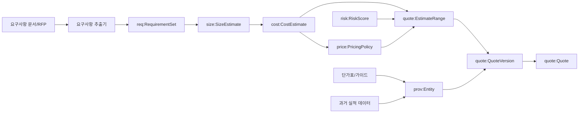
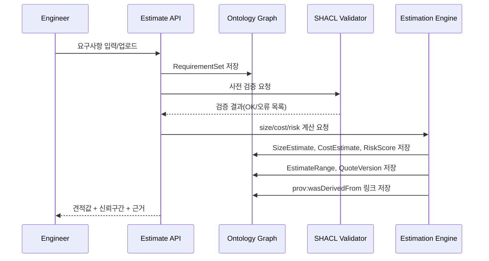
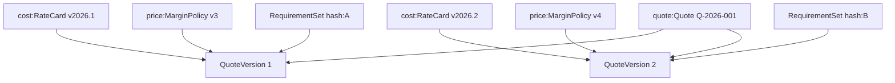

# 03. Relationship Diagrams

## 1) System Context



## 2) Class Relationship

```mermaid
classDiagram
  class Project
  class RequirementSet
  class Requirement
  class SizeEstimate
  class CostEstimate
  class PricingPolicy
  class RiskScore
  class EstimateRange
  class Quote
  class QuoteVersion
  class Assumption
  class ProvenanceEntity

  RequirementSet "1" <-- "N" Requirement : belongsToSet
  Requirement "N" --> "N" SizeEstimate : drivesSize
  SizeEstimate "1" --> "N" CostEstimate : informsCost
  CostEstimate "N" --> "1" PricingPolicy : pricedBy
  RiskScore "1" --> "1" EstimateRange : adjustsRange
  Quote "1" --> "N" QuoteVersion : hasVersion
  QuoteVersion "N" --> "N" Assumption : usesAssumption
  QuoteVersion "N" --> "1" RequirementSet : derivedFromRequirementSet
  QuoteVersion "N" --> "N" ProvenanceEntity : prov:wasDerivedFrom
```

## 3) Estimate Generation Flow



## 4) Versioning Relationship



